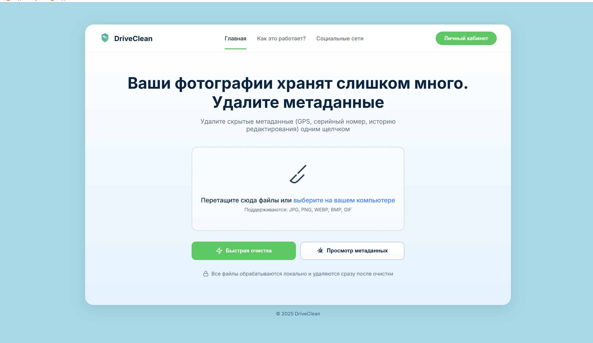
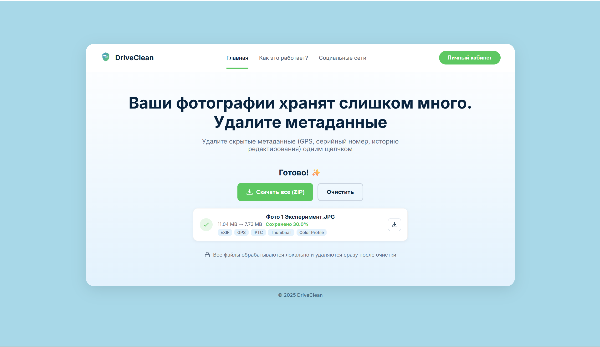
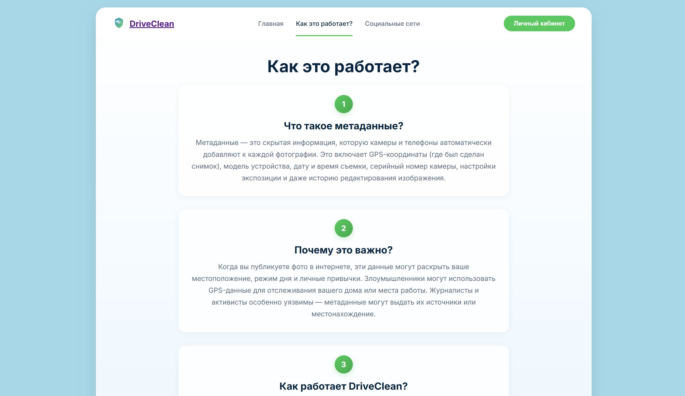
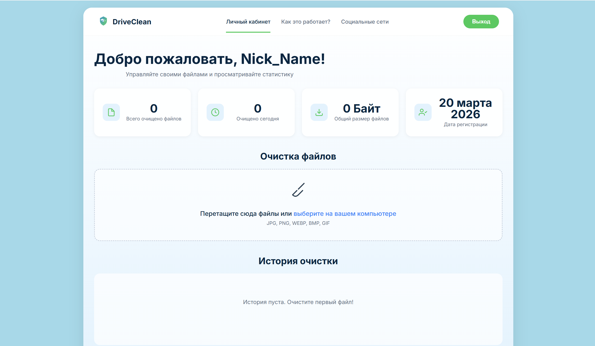

# DriveClean

Веб-сервис для удаления EXIF-метаданных из фотографий с локальной обработкой в браузере и личным кабинетом. Все файлы остаются на устройстве пользователя и никогда не загружаются на сервер.

## Скриншоты

### Главная страница — загрузка файлов
Интуитивный drag & drop интерфейс с поддержкой JPG, PNG, WEBP, BMP, GIF.



### Результат очистки — удаление метаданных
Мгновенное удаление EXIF, GPS, IPTC, Thumbnail, Color Profile с отображением экономии размера файла.



### Как это работает
Пошаговое описание работы сервиса: что такое метаданные, почему это важно и как DriveClean их удаляет.



### Личный кабинет
Статистика обработанных файлов, очистка с сохранением истории, управление аккаунтом.



## Возможности

- Удаление EXIF, IPTC, XMP, GPS и других метаданных из изображений
- Локальная обработка — файлы не покидают браузер пользователя
- Поддержка форматов: JPEG, PNG, WebP, BMP, GIF
- Пакетная обработка нескольких файлов одновременно
- Скачивание результатов в ZIP-архиве
- Личный кабинет с историей и статистикой
- Админ-панель с аналитикой
- Адаптивный дизайн (десктоп + мобильные устройства)

## Требования

- PHP `8.1+`
- Composer
- MySQL / MariaDB
- `git`
- Веб-сервер (Apache / Nginx)
- PHP-расширения: `gd`, `mbstring`, `openssl`, `pdo`, `tokenizer`, `xml`

## Быстрый старт

### 1. Клонирование

```bash
git clone https://github.com/smetanaaaaa/DriveClean.git
cd DriveClean
```

### 2. Установка

```bash
composer install
cp .env.example .env
php artisan key:generate
```

### 3. Настройка базы данных

В файле `.env` укажите параметры подключения:

```
DB_CONNECTION=mysql
DB_HOST=127.0.0.1
DB_PORT=3306
DB_DATABASE=driveclean
DB_USERNAME=root
DB_PASSWORD=your_password
```

Затем выполните миграции:

```bash
php artisan migrate
```

### 4. Запуск

```bash
php artisan serve
```

Сервер поднимется на `http://127.0.0.1:8000`.

## Структура проекта

```
app/                    — Backend (Laravel)
├── Http/Controllers/   — Контроллеры
├── Models/             — Модели
└── Middleware/          — Middleware

public/assets/main/
├── css/                — Стили
└── js/                 — JavaScript (ExifRemover, ExifReader)

resources/views/        — Blade-шаблоны
├── main/               — Основные страницы
├── admin/              — Админ-панель
└── components/         — Компоненты
```

## Безопасность

- Обработка файлов выполняется локально в браузере (Canvas API)
- Файлы не загружаются на сервер при использовании главной страницы
- Пароли хранятся в зашифрованном виде (bcrypt)
- Защита от CSRF-атак
- HTTPS-соединение

## Дополнительная информация

Для разработки проекта использовались:

- PHP 8.1+ / Laravel 10
- JavaScript (Canvas API для удаления метаданных)
- VS Code
- Навыки в программировании и клавиатура

```
Открытый код-проект для Московской олимпиады "Инженеры Будущего"
участника 11Б класса Чабана Михаила.
2025-20xx
```
